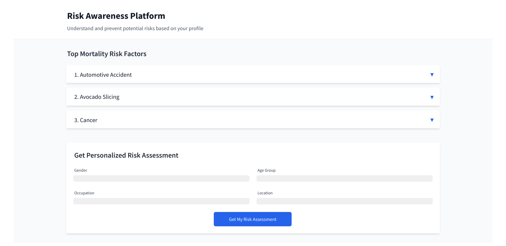

# Projects

## Current

### Save 58

**Inspiration**: [Kurzgesagt – In a Nutshell: This Video Might Save 58 Lives Next Week](https://www.youtube.com/watch?v=oTx-GSF3cts&rco=1)

**Hypothesis**: Can an automated message (email, tweet, slack, video) save lives?

**Premise**: Can providing statistically likely causes for death or injury for a specific person's demographic (age, gender, profession) combined with current conditions (date, geography, weather) result in that person being mindful of the particular danger to save their life?
Pros:

- This is a deceptively hard problem involving multi dimensional. big data. It could easily keep intern teams occupied for several years
- Decomposable. Its possible to focus this project into smaller, month long deliverables that are challenging.
- Motivational mission. It feels good to do some good.
- Potentially marketable as doing good

Cons:

- Delicate topics for the work place. See the video.
- Not profitable without turning people into the product.

[Impact Map](https://www.figma.com/board/fFXs28L1ksyuKkQVtAs3Vc/Save58?node-id=0-1&p=f&t=BZtWKYV4vGrxN5Zc-0)

#### Business Value

- Data science tooling
  - iceburg
  - developing a model
- Data/ETL
  - repeatable data scraping
  - automated data evaluation
- New technologies
  - sveltekit
  - nix/flake
  - tauri
  - multi dimension database
  - automated web scrapping
  - biome

#### Next steps

- Week 0
  1. Evaluate data
  1. Boot strap project
     - Repo
       - monorepo
       - think about directory structure for data, server, client
     - Tooling: direnv / nix flake <- Daniel or Kyle?
     - Typescript/Sveltekit
       - tooling/one off scripts can be polyglot
     - Linter/formatter - [biome](https://github.com/biomejs/biome)
     - Postgresql docker?
     - CI - github actions
     - README
  1. Management
     - Assign primary mentors
       - pick days in office
     - Laptops - MCD acting
     - github/slack access
  1. Impact map/Stories
     - Review notes
     - Need more challenges
- Week 1
  - [The missing semester](https://missing.csail.mit.edu/)
    - Review the first six chapters
    - Command-line Environment and Version Control (Git) will be really helpful
    - Ask lots of questions
  - link [4cs](https://www.mojotech.com/blog/the-4cs-a-code-review-mnemonic/)
  - Tool setup
    - Checkout github repo. Work through README
    - Ask fellow mojos! #internship #engineering
  - First commit?
  - Discovery
- Week 2 - atomic commits / unraveling git commit
  - auth
    - auth0?
    - <https://svelte.dev/docs/kit/auth>
  - Implement boilerplate design? Jesse has a headless UI library he likes
    - Anonymous user landing page
    - Authenticated user page
    - privacy policy
  - Scraping/Data collection
    - Aggregate data
    - Automate import into database
  - unit test / some web output for
    > Week before day light savings time, "start shifting your schedule by 15 minutes earlier/later. heart attacks and car crashes increase after day light savings time due to sleep deprivation"
- Week 3
  - Ticket work.
- Week 4
  - Ticket work.

##### Shallow vs deep

Shallow is a first step to get something working. Deep is a thorough tech investigation

###### Shallow

- Json / csv in git
- Manual algorithm
- Web app only
- Manual notification trigger via web
- Manual data scrapping

###### Deep

- Apache iceburg for storage sharing. Data lake. <- Eric Gibb
- Multi dimension data in postgresql / vector storage
- Desktop/mobile version via Tauri
- Worker queue for pre calculating and notifications. Different queue/worker than previous mojo work not redis/sidekiq/bullmq
- Automated LLMs scrapping

###### Thoughts

We should have a very clear [privacy policy](https://openpd.org/)

Landing on the page should engage the user with data driven from form. This can lead towards creating an account to provide more specific information on a schedule.

Dog Fooding. Plugging in "Software Engineer" + "Remote" + "No standing desk" = "make sure to walk around every hour"

Living in downtown Manhatten on a Sunday morning, "be careful slicing the bagel this morning. X% of ER visits from from bagel slices today"

Week before day light savings time, "start shifting your schedule by 15 minutes earlier/later. heart attacks and car crashes increase after day light savings time due to sleep deprivation"

Needs to be friendly and not anxiety inducing. Carson mentioned the [Citizen](https://citizen.com/) app as the antithesis.

#### Wireframe



#### Investigation

- Rhode Island
  - [Death Records](https://health.ecms.ri.gov/data/death-records-leading-causes-death)
  - [Injury Surveillance Data](https://health.ri.gov/data/injury-surveillance-data)
  - [Hospital Discharge Data](https://health.ri.gov/data/hospital-discharge-data)
    - Note: the request form seems to require $100 per data file and year processing fee. ~$2000 + processing time
- [Kurzgesagt Sources](https://sites.google.com/view/sources-this-video-will-save/)
  - [The cause-of-death data have been extracted from WHO’s Mortality Database using the Cause of Death Explorer, and extracting the data for our demographic for each death cause mentioned in the video, as well as the total deaths from all causes in our demographic to calculate proportions.](https://platform.who.int/mortality/themes/theme-details/MDB/all-causes)
  - [Please keep in mind the following considerations on this data:](https://platform.who.int/mortality/about/about-the-who-mortality-database)
  - [Stadiums of similar capacity include the Allianz Arena in Munich or the Empower Field in Denver.](https://allianz-arena.com/en/arena/facts/general-information)
  - [Empower Field: “About us” (retrieved 2024)](https://www.empowerfieldatmilehigh.com/stadium/about-us)
  - [World Health Organization, European region: “SDR(15-29), All causes, per 100 000” (retrieved 2024)](https://gateway.euro.who.int/en/indicators/hfamdb_105-sdr-15-29-all-causes-per-100-000/#id=29323)
  - [Our World in Data: “Annual death rate by age group, United States, 2021”](https://ourworldindata.org/grapher/annual-death-rate-by-age-group)
  - [Our World in Data: “Terrorism deaths rate, 2011 to 2021 (retrieved 2024)](https://ourworldindata.org/grapher/terrorism-deaths-rate?tab=chart&time=2011..latest&country=CAN~GBR~OWID_EUR~USA~AUS)
  - [A Westman et al. Parachuting from fixed objects: descriptive study of 106 fatal events in BASE jumping 1981–2006. Br J Sports Med. 2008](https://bjsm.bmj.com/content/42/6/431)
  - [Mei-Dan, Omer et al. (2013): “Fatalities in Wingsuit BASE Jumping” Wilderness & Environmental Medicine, vol. 24, 4, 321-327.](https://journals.sagepub.com/doi/full/10.1016/j.wem.2013.06.010#bibr3-jwem201306010)
  - [U.S. department of energy: “Average Annual Vehicle Miles Traveled per Vehicle by Major Vehicle Category” (retrieved 2024)](https://afdc.energy.gov/data/10309)
  - [United States Department of Transportation: “Motorcycle Safety”](https://www.nhtsa.gov/book/countermeasures-that-work/motorcycle-safety)
  - [World Health Organization Mortality Database: “Causes of Death Explorer: Road traffic accidents”](https://platform.who.int/mortality/themes/theme-details/topics/indicator-groups/indicator-group-details/MDB/road-traffic-accidents)
  - [Hunter, Luke (2020): “The Cheetah’s Speed Limit” Wild View, Wildlife Conservation Society](https://blog.wcs.org/photo/2020/10/08/the-cheetahs-speed-limit-africa/)
  - [International Council on Clean Transportation (2022): “European Market vehicle statistics”](https://theicct.org/wp-content/uploads/2021/12/ICCT-EU-Pocketbook-2021-Web-Dec21.pdf)
  - [U.S. Environmental Protection Agency Automotive Trends Report (2023): “Automotive Trends Report“](https://www.epa.gov/system/files/documents/2023-12/420r23033.pdf)
  - [National Park Service U.S.: “The statue of Liberty” (retrieved 2024)](https://www.nps.gov/stli/learn/historyculture/statue-statistics.htm)
  - [Petrof: “What is the size of the grand piano and the upright piano?” (retrieved 2024)](https://www.petrof.com/what-is-the-size-of-the-grand-piano-and-the-upright-piano)
  - [Royal Society for the Prevention of Accidents (2018): “Road Safety Factsheet”](https://www.rospa.com/rospaweb/docs/advice-services/road-safety/drivers/inappropriate-speed.pdf)
  - [Quote: “Inappropriate speed contributes to around 11% of all injury collisions reported to the police, 15% of crashes resulting in a serious injury and 24% of collisions that result in a death. This includes both ‘excessive speed’, when the speed limit is exceeded but also driving or riding within the speed limit when this is too fast for the conditions at the time (for example, in poor weather, poor visibility or high pedestrian activity).”](https://crashstats.nhtsa.dot.gov/Api/Public/ViewPublication/813313)
  - [World Health Organization: “Managing speed” (2017)](https://www.who.int/publications/i/item/managing-speed)
  - [Perez, Miguel A. et al (2021): “Factors modifying the likelihood of speeding behaviors based on naturalistic driving data”, Accident Analysis & Prevention, vol. 159, 106267](https://www.sciencedirect.com/science/article/abs/pii/S0001457521002980)
  - [World Health Organization (2023): “Road traffic injuries”](https://www.who.int/news-room/fact-sheets/detail/road-traffic-injuries)
  - [National Highway Traffic Safety Administration (2020): “Traffic Safety Facts: Young Drivers”](https://crashstats.nhtsa.dot.gov/Api/Public/ViewPublication/813313)
  - [World Health Organization (2019): “SAFER: Advance and enforce drink driving counter measures”](https://www.who.int/initiatives/SAFER/drink-driving)
  - [European Comission (2023): “New report from the European Road Safety Observatory: focus on drink driving”](https://road-safety.transport.ec.europa.eu/news-events/news/new-report-european-road-safety-observatory-focus-drink-driving-2023-10-12_en)
  - [European Comission (2022): “Road Safety Thematic Report – Driver distraction”](https://road-safety.transport.ec.europa.eu/system/files/2022-04/Road_Safety_Thematic_Report_Driver_Distraction_2022.pdf)
  - [National Highway Traffic Safety Administration (2021): “Distracted Driving 2019”](https://crashstats.nhtsa.dot.gov/Api/Public/ViewPublication/813111)
  - [Australian Automobile Association: “Distracted driving” (retrieved 2024)](https://www.aaa.asn.au/research/distracted-driving/)
  - [IFAB: "The Field of Play" (retrieved 2024)](https://www.theifab.com/laws/latest/the-field-of-play/#field-surface)
  - [National Highway Traffic Safety Administration (2020): “Traffic Safety Facts: Young Drivers”](https://crashstats.nhtsa.dot.gov/Api/Public/ViewPublication/813313)
  - [European Transport Safety Council (2006): “Seat Belt Reminders: Implementing advanced safety technology in Europe’s cars”](https://archive.etsc.eu/documents/ETSC_Seat_belt_reminder_oct_06.pdf)
  - [U.S. Centers for Disease Control and Prevention (2024): “Leading Causes of Nonfatal Emergency Department Visits”](https://wisqars.cdc.gov/lcnf/?y1=2022&y2=2022&ct=10&cc=0&s=0&g=00&a=custom&a1=15&a2=34&d=0)
  - [U.S. Census bureau: “National Population by Characteristics: 2020-2023” (retrieved 2024)](https://www.census.gov/data/tables/time-series/demo/popest/2020s-national-detail.html)
  - [World Health Organization Mortality Database: “Causes of Death Explorer: Falls”](https://platform.who.int/mortality/themes/theme-details/topics/indicator-groups/indicator-group-details/MDB/falls)
  - [World Health Organization Mortality Database: “Causes of Death Explorer: Drownings”](https://platform.who.int/mortality/themes/theme-details/topics/indicator-groups/indicator-group-details/MDB/drownings)
  - [Armstrong, Erika J.; Erskine, Kevin L (2018): “Investigation of Drowning Deaths: A Practical Review”](https://www.ncbi.nlm.nih.gov/pmc/articles/PMC6474464/)
  - [U.S. Centers for Disease Control and Prevention (2024): “Drowning Facts”](https://www.cdc.gov/drowning/data-research/facts/index.html)
  - [U.S. Centers for Disease Control and Prevention (2024):“WISQARS Leading Causes of Death Visualization Tool: Ages 5 to 14”](https://wisqars.cdc.gov/lcd/?o=LCD&y1=2019&y2=2019&ct=10&cc=UNI&g=00&s=0&r=0&ry=2&e=0&ar=lcd1age&at=custom&ag=lcd1age&a1=5&a2=14)
  - [— Also for the love of god, be careful on cruise ships – if you fall into the water you have a 60% chance of dying.](https://www.washingtonpost.com/travel/2023/07/31/cruise-ship-fall-death)
  - [Gönel, Orhan; Çiçek, İsmail (2020): “Statistical analysis of Man Overboard (MOB) incidents”. Chapter in “Engineering and Architecture Sciences: Theory, Current Research and New Trends”, edited by Dr. Emine Yildiz Kuyrikçu . IVPE Publisher.](https://www.researchgate.net/publication/348266442_STATISTICAL_ANALYSIS_OF_MAN_OVER_BOARD_MOB_INCIDENTS)
  - [World Health Organization Mortality Database: “Causes of Death Explorer: Self-inflicted injuries”](https://platform.who.int/mortality/themes/theme-details/topics/indicator-groups/indicator-group-details/MDB/self-inflicted-injuries)
  - [Cooper, Jessica;  Appleby, Louise;  Amos, T. (2002): “Life events preceding suicide by young people”  Social psychiatry and psychiatric epidemiology, vol. 37, 6, 271–275](https://link.springer.com/article/10.1007/s001270200019)
  - [Liu, Richard T.; Miller, Ivan (2014): “Life events and suicidal ideation and behavior: A systematic review” Clinical Psychology Review, vol. 34, 3, 181-192](https://www.sciencedirect.com/science/article/abs/pii/S0272735814000348?via%3Dihub)
  - [Bader, S. et al. (2021): “Warning signs of suicide attempts and risk of suicidal recurrence” European Psychiatry, vol. 64](https://www.ncbi.nlm.nih.gov/pmc/articles/PMC9480028/)
  - [Kim, Eun Ji et al. (2022): “Comparing warning signs of suicide between suicide decedents with depression and those non-diagnosed psychiatric disorders” Suicide Life Threat Behavior, vol. 52, 178-189](https://onlinelibrary.wiley.com/doi/full/10.1111/sltb.12739)
  - [Harvard T.H. Chan School of Public Health: “Attempters’ Longterm Survival”, 2002](https://www.hsph.harvard.edu/means-matter/means-matter/survival/)
  - [World Health Organization Mortality Database: “Causes of Death Explorer: Malignant Neoplasms”](https://platform.who.int/mortality/themes/theme-details/topics/topic-details/MDB/malignant-neoplasms)
  - [National Cancer Institute: “Adolescents and Young Adults with Cancer”](https://www.cancer.gov/types/aya)
  - [Trama, Annalisa et al. (2023): “Cancer burden in adolescents and young adults in Europe”, European Society for Medical Oncology, vol. 8,1](https://pubmed.ncbi.nlm.nih.gov/36753992/)
  - [Everyone should know how their breasts normally look and feel and report any changes to a health care provider right away. It is recommended to perform a breast self-exam once a month:](https://my.clevelandclinic.org/health/diagnostics/3990-breast-self-exam)
  - [If you have testicles and have already undergone puberty, some doctors also recommend a monthly testicular self-exam to get to know what's normal for you and to be able to report any changes to your healthcare provider without delay:](https://www.testicularcancerawarenessfoundation.org/self-exam-resources)
  - [Testicular Cancer Awareness foundation: “Monthly testicular self-exam” (retrieved 2024) https://www.testicularcancerawarenessfoundation.org/self-exam-resources](https://www.aace.com/disease-and-conditions/thyroid/how-check-your-thyroid)
  - [Though not customarily recommended due to the risk of false positives, it is possible to perform a thyroid self-examination. However, keep in mind that the thyroid gland may appear enlarged or bumps on your neck may appear for many reasons other than cancer. #American Association of Clinical Endocrinology: “How to check your thyroid” (retrieved 2024) https://www.aace.com/disease-and-conditions/thyroid/how-check-your-thyroid](https://www.cancer.org/cancer/types/breast-cancer/risk-and-prevention.html)
  - [United States](https://www.cancer.org/cancer/screening/screening-recommendations-by-age.html)
  - [United Kingdom](https://www.cancerresearchuk.org/health-professional/cancer-screening)
  - [https://www.cancerresearchuk.org/health-professional/cancer-screening](https://cancer.ca/en/cancer-information/find-cancer-early/screening-for-cancer)
  - [Canadahttps://cancer.ca/en/cancer-information/find-cancer-early/screening-for-cancer](https://screeningresources.cancervic.org.au/sections/national-cancer-screening-programs)
  - [Australiahttps://screeningresources.cancervic.org.au/sections/national-cancer-screening-programs](https://www.bundesgesundheitsministerium.de/krebsfrueherkennung)
  - [American Cancer Society: “Can Melanoma Skin Cancer Be Prevented?” (retrieved 2024)](https://www.cancer.org/cancer/types/melanoma-skin-cancer/causes-risks-prevention/prevention.html)
  - [U.S. Centers for Disease Control and Prevention (2023): “Reducing Risk for Skin Cancer”](https://www.cdc.gov/skin-cancer/prevention/index.html)
  - [Melanoma Institute Australia: “How to Prevent Melanoma” (retrieved 2024)](https://melanoma.org.au/about-melanoma/how-to-prevent-melanoma/)
  - [World Health Organization Mortality Database: “Causes of Death Explorer: Malignant Skin Melanoma”](https://platform.who.int/mortality/themes/theme-details/topics/indicator-groups/indicators/indicator-details/MDB/a-malignant-skin-melanoma)

## Legacy

### Helios

Helios is our weather/welcome display for the Providence and Boulder front door. It serves as an opportunity to welcome guests and show off some our technical expertise.

- Front-end
  - react: <https://reactjs.org/>
  - apollo client: <https://www.apollographql.com/docs/react/>
  - ramdajs: <https://ramdajs.com/>
  - matter.js: <http://brm.io/matter-js/>
- Back-end
  - ruby on rails: <https://rubyonrails.org/>
  - graphql-ruby: <https://github.com/rmosolgo/graphql-ruby>
  - postgresql: <https://www.postgresql.org/>
  - redis: <https://redis.io/>
- APIs
  - <https://openweathermap.org/api>
  - <https://github.com/>
  - <https://slack.com/>
  - <https://twitter.com/>
- graphql: <https://graphql.org/>
- docker: <https://www.docker.com/>

### StandupHub

[StandupHub](https://www.standuphub.com/) is a web service to easily track your tasks and their statuses for standup.

#### Stack

- PT issues: <https://www.pivotaltracker.com/n/projects/1553257>
- Slack: #standuphub
- Front-end
  - github: <https://github.com/mojotech/standup-web>
  - react 16: <https://reactjs.org/>
  - redux: <https://redux.js.org/>
- Back-end
  - github: <https://github.com/mojotech/standup-api-ex>
  - Phoenix: <https://www.phoenixframework.org/>
  - Elixir: <https://elixir-lang.org/>
- Back-end (legacy)
  - <https://github.com/mojotech/standup-api>
- docker: <https://www.docker.com/>

#### Startup

```sh
cd standuphub-api-ex
# start a pgsl instance on localhost:5432. You can use an OS service instead of docker
docker-compose up db
# start the phoenix server on localhost:4000 connected to localhost for database
mix phx.server
cd ../standuphub-web
# start webpack server on localhost:3000 pointed to the local phoenix server the API server
REACT_APP_API_SERVER=http://localhost:4000 yarn start
```
